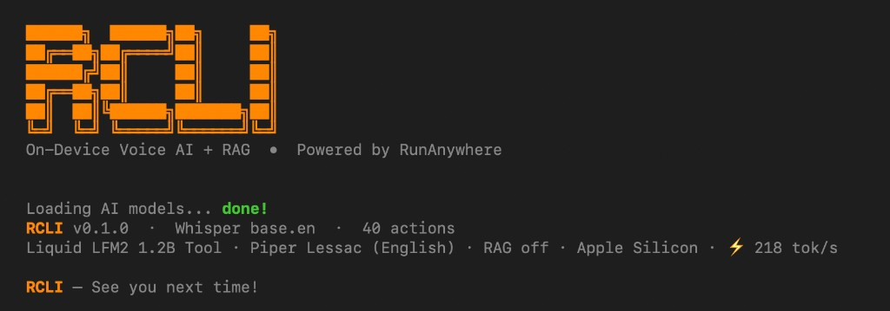

# RCLI

**Voice-first AI for macOS. Talk to your Mac, query your docs, all on-device.**

[](https://github.com/RunanywhereAI/RCLI) [](https://github.com/RunanywhereAI/RCLI) [](https://github.com/RunanywhereAI/RCLI) [](https://github.com/RunanywhereAI/RCLI) [](LICENSE)

A complete STT + LLM + TTS pipeline running on Apple Silicon with Metal GPU. 40 macOS actions via voice or text. Local RAG over your documents. Sub-200ms end-to-end latency. No cloud, no API keys.

## Table of Contents

- [Install](#install)
- [Quick Start](#quick-start)
- [Features](#features)
- [Models](#models)
- [Benchmarks](#benchmarks)
- [Architecture](#architecture)
- [Build from Source](#build-from-source)
- [Contributing](#contributing)
- [License](#license)

## Install

```bash
brew tap RunanywhereAI/rcli https://github.com/RunanywhereAI/RCLI.git
brew install rcli
rcli setup     # downloads default models (~1GB, one-time)
```

Requires macOS 13+ on Apple Silicon (M1 or later).

> [!NOTE]
> **macOS 26 beta:** Homebrew does not yet recognize macOS 26 CLT versions. If `brew install` fails, download the [latest release](https://github.com/RunanywhereAI/RCLI/releases/latest) tarball and install manually:
>
> ```bash
> brew tap RunanywhereAI/rcli https://github.com/RunanywhereAI/RCLI.git
> cd /tmp && curl -fsSL -o rcli.tar.gz "https://github.com/RunanywhereAI/RCLI/releases/latest/download/rcli-0.1.2-Darwin-arm64.tar.gz"
> tar xzf rcli.tar.gz
> CELLAR="/opt/homebrew/Cellar/rcli/0.1.2"
> rm -rf "$CELLAR" && mkdir -p "$CELLAR/bin" "$CELLAR/lib"
> cp rcli-*/bin/rcli "$CELLAR/bin/" && cp rcli-*/lib/*.dylib "$CELLAR/lib/"
> brew link --overwrite rcli
> rcli setup
> ```

## Quick Start

```bash
rcli                             # interactive TUI (push-to-talk + text)
rcli listen                      # continuous voice mode, always listening
rcli ask "open Safari"           # one-shot text command
rcli ask "create a note called Meeting Notes"
rcli ask "play some jazz on Spotify"
```

Run `rcli actions` to see all 40 available macOS actions, or `rcli --help` for the full CLI reference.

## Features

### Voice Pipeline

A complete STT, LLM, TTS pipeline running on Metal GPU with three concurrent threads:

- **VAD** — Silero voice activity detection, filters silence in real-time
- **STT** — Zipformer streaming (live mic) + Whisper/Parakeet offline (batch)
- **LLM** — Liquid LFM2 1.2B Tool with system prompt KV caching and Flash Attention
- **TTS** — Double-buffered sentence-level synthesis (next sentence synthesizes while current plays)
- **Tool Calling** — Hybrid approach: Tier 1 keyword match + Tier 2 LLM-based extraction

### macOS Actions

Control your Mac by voice or text. RCLI classifies intent and executes 40 actions locally via AppleScript and shell commands.

| Category | Actions |
|----------|---------|
| **Productivity** | `create_note`, `create_reminder`, `run_shortcut` |
| **Communication** | `send_message`, `facetime_call`, `facetime_audio` |
| **Media** | `play_on_spotify`, `play_apple_music`, `play_pause_music`, `next_track`, `previous_track`, `set_music_volume`, `get_now_playing` |
| **System** | `open_app`, `quit_app`, `switch_app`, `set_volume`, `toggle_dark_mode`, `lock_screen`, `screenshot`, `search_files`, `open_settings`, `open_url` |
| **Window** | `close_window`, `minimize_window`, `fullscreen_window`, `get_frontmost_app`, `list_apps` |
| **Info** | `get_battery`, `get_wifi`, `get_ip_address`, `get_uptime`, `get_disk_usage` |
| **Web / Nav** | `search_web`, `search_youtube`, `get_browser_url`, `get_browser_tabs`, `open_maps`, `clipboard_read`, `clipboard_write` |

### RAG (Retrieval-Augmented Generation)

Index local documents and query them by voice or text. Hybrid retrieval combining vector search (USearch HNSW) and BM25 full-text search, fused via Reciprocal Rank Fusion. Retrieval latency is ~4ms over 5K+ chunks.

```bash
rcli rag ingest ~/Documents/notes
rcli rag query "What were the key decisions from last week?"
rcli ask --rag ~/Library/RCLI/index "summarize the project plan"
```

### Interactive TUI

A terminal dashboard built with [FTXUI](https://github.com/ArthurSonzogni/FTXUI) featuring push-to-talk voice input, live hardware monitoring (CPU, GPU, memory), real-time performance metrics, model management, and an actions browser.

## Models

RCLI downloads a default model set during `rcli setup` and provides CLI-based model management to download, switch, and remove models across all modalities.

### Defaults (installed by `rcli setup`)

| Component | Model | Size |
|-----------|-------|------|
| LLM | Liquid LFM2 1.2B Tool (Q4_K_M) | 731 MB |
| STT | Zipformer streaming + Whisper base.en | ~190 MB |
| TTS | Piper Lessac (English) | ~60 MB |
| VAD | Silero VAD | 0.6 MB |
| Embeddings | Snowflake Arctic Embed S (Q8_0) | 34 MB |

<details>
<summary><strong>All available LLMs</strong></summary>

| Model | Size | Speed | Tool Calling | Notes |
|-------|------|-------|-------------|-------|
| Liquid LFM2 1.2B Tool | 731 MB | ~180 t/s | Excellent | **Default** — purpose-built for tool calling |
| Qwen3 0.6B | 456 MB | ~250 t/s | Basic | Ultra-fast, smallest footprint |
| Qwen3.5 0.8B | 600 MB | ~220 t/s | Basic | Qwen3.5 generation |
| Liquid LFM2 350M | 219 MB | ~350 t/s | Basic | Fastest inference, 128K context |
| Liquid LFM2.5 1.2B Instruct | 731 MB | ~180 t/s | Good | 128K context |
| Liquid LFM2 2.6B | 1.5 GB | ~120 t/s | Good | Stronger conversational |
| Qwen3.5 2B | 1.2 GB | ~150 t/s | Good | Good all-rounder |
| Qwen3 4B | 2.5 GB | ~80 t/s | Good | Smart reasoning |
| Qwen3.5 4B | 2.7 GB | ~75 t/s | Excellent | Best small model, 262K context |

</details>

<details>
<summary><strong>All available TTS voices</strong></summary>

| Voice | Architecture | Speakers | Quality | Size |
|-------|-------------|----------|---------|------|
| Piper Lessac | VITS | 1 | Good | 60 MB |
| Piper Amy | VITS | 1 | Good | 60 MB |
| KittenTTS Nano | Kitten | 8 | Great | 90 MB |
| Matcha LJSpeech | Matcha | 1 | Great | 100 MB |
| Kokoro English v0.19 | Kokoro | 11 | Excellent | 310 MB |
| Kokoro Multi-lang v1.1 | Kokoro | 103 | Excellent | 500 MB |

</details>

<details>
<summary><strong>All available STT models</strong></summary>

| Model | Category | Accuracy | Size |
|-------|----------|----------|------|
| Zipformer | Streaming (live mic) | Good | 50 MB |
| Whisper base.en | Offline | ~5% WER | 140 MB |
| Parakeet TDT 0.6B v3 | Offline | ~1.9% WER | 640 MB |

</details>

### Model Commands

```bash
rcli models                  # interactive model management (all modalities)
rcli models llm              # jump to LLM management
rcli upgrade-llm             # guided LLM upgrade
rcli upgrade-stt             # upgrade to Parakeet TDT (~1.9% WER)
rcli voices                  # browse, download, switch TTS voices
rcli cleanup                 # remove unused models to free disk space
rcli info                    # show engine info and installed models
```

Models are stored in `~/Library/RCLI/models/`. Active model selection persists across launches in `~/Library/RCLI/config`.

## Benchmarks

All measurements on Apple M3 Max (14-core CPU, 30-core GPU, 36 GB unified memory).

| Component | Metric | Value |
|-----------|--------|-------|
| **STT** | Avg latency | 43.7 ms |
| **STT** | Real-time factor | 0.022x |
| **LLM** | Time to first token | 22.5 ms |
| **LLM** | Generation throughput | 159.6 tok/s |
| **TTS** | Avg latency | 150.6 ms |
| **RAG** | Hybrid retrieval | 3.82 ms |
| **E2E** | Voice-in to audio-out | **131 ms** |

```bash
rcli bench                          # run all benchmarks
rcli bench --suite llm              # LLM only
rcli bench --all-llm --suite llm    # compare all installed LLMs
rcli bench --output results.json    # export to JSON
```

Suites: `stt`, `llm`, `tts`, `e2e`, `tools`, `rag`, `memory`, `all`.

## Architecture

```
Mic → VAD → STT → [RAG] → LLM → TTS → Speaker
                            |
                     Tool Calling → 40 macOS Actions
```

Three dedicated threads in live mode, synchronized via condition variables:

| Thread | Role |
|--------|------|
| STT | Captures mic audio, runs VAD, detects speech endpoints |
| LLM | Receives transcribed text, generates tokens, dispatches tool calls |
| TTS | Queues sentences from LLM, double-buffered playback |

**Design decisions:**

- 64 MB pre-allocated memory pool — no runtime malloc during inference
- Lock-free ring buffers — zero-copy audio transfer between threads
- System prompt KV caching — reuses llama.cpp KV cache across queries
- Sentence-level TTS scheduling — next sentence synthesizes while current plays
- Hardware profiling at startup — detects P/E cores, Metal GPU, RAM for optimal config

### Project Structure

```
src/
  engines/     STT, LLM, TTS, VAD, embedding engine wrappers
  pipeline/    Orchestrator, sentence detector, text sanitizer
  rag/         Vector index, BM25, hybrid retriever, document processor
  core/        Types, ring buffer, memory pool, hardware profiler
  audio/       CoreAudio mic/speaker I/O
  tools/       Tool calling engine with JSON schema definitions
  bench/       Benchmark harness
  actions/     40 macOS action implementations
  api/         C API (rcli_api.h) — public engine interface
  cli/         TUI dashboard (FTXUI), CLI commands
  models/      Model registries (LLM, TTS, STT)
scripts/       setup.sh, download_models.sh, package.sh
Formula/       Homebrew formula (self-hosted tap)
```

## Build from Source

```bash
git clone https://github.com/RunanywhereAI/RCLI.git && cd RCLI
bash scripts/setup.sh              # clone llama.cpp + sherpa-onnx
bash scripts/download_models.sh    # download models (~1GB)
mkdir -p build && cd build
cmake .. -DCMAKE_BUILD_TYPE=Release
cmake --build . -j$(sysctl -n hw.ncpu)
./rcli
```

### Dependencies

All vendored or CMake-fetched. No external package manager required.

| Dependency | Purpose |
|------------|---------|
| [llama.cpp](https://github.com/ggml-org/llama.cpp) | LLM + embedding inference with Metal GPU |
| [sherpa-onnx](https://github.com/k2-fsa/sherpa-onnx) | STT / TTS / VAD via ONNX Runtime |
| [USearch](https://github.com/unum-cloud/usearch) | HNSW vector index for RAG |
| [FTXUI](https://github.com/ArthurSonzogni/FTXUI) | Terminal UI library |
| CoreAudio, Metal, Accelerate, IOKit | macOS system frameworks |

Requires CMake 3.15+ and Apple Clang (C++17).

<details>
<summary><strong>CLI Reference</strong></summary>

```
rcli                          Interactive TUI (push-to-talk + text)
rcli listen                   Continuous voice mode (always listening)
rcli ask <text>               One-shot text command
rcli actions [name]           List actions or show detail for one
rcli action <name> [json]     Execute action directly
rcli rag ingest <dir>         Index documents for RAG
rcli rag query <text>         Query indexed documents
rcli rag status               Show index info
rcli models [llm|stt|tts]    Manage AI models
rcli voices                   Manage TTS voices
rcli upgrade-llm              Download a larger LLM
rcli upgrade-stt              Download Parakeet TDT
rcli bench [--suite ...]      Run benchmarks
rcli cleanup                  Remove unused models
rcli setup                    Download default models (~1GB)
rcli info                     Show engine info and installed models

Options:
  --models <dir>      Models directory (default: ~/Library/RCLI/models)
  --rag <index>       Load RAG index for document-grounded answers
  --gpu-layers <n>    GPU layers for LLM (default: 99 = all)
  --ctx-size <n>      LLM context size (default: 4096)
  --no-speak          Text output only (no TTS playback)
  --verbose, -v       Show debug logs
```

</details>

## Contributing

Contributions are welcome. See [CONTRIBUTING.md](CONTRIBUTING.md) for build instructions, architecture overview, and how to add new actions, models, or voices.

## License

MIT License. See [LICENSE](LICENSE) for details.

Built by [RunAnywhere AI](https://github.com/RunanywhereAI).
